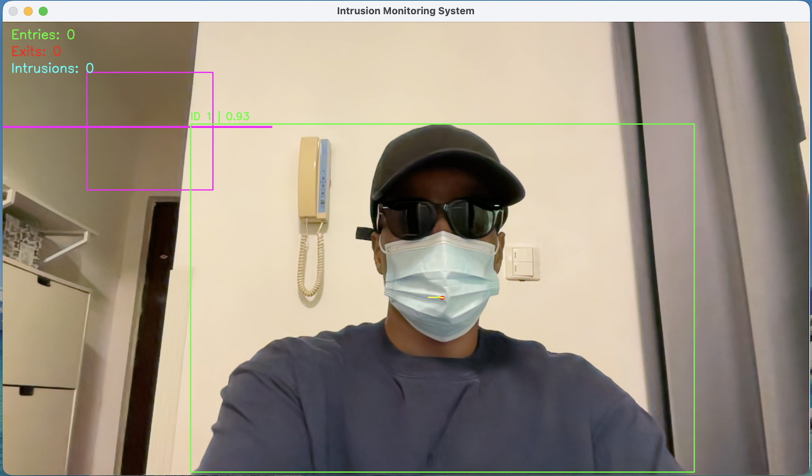
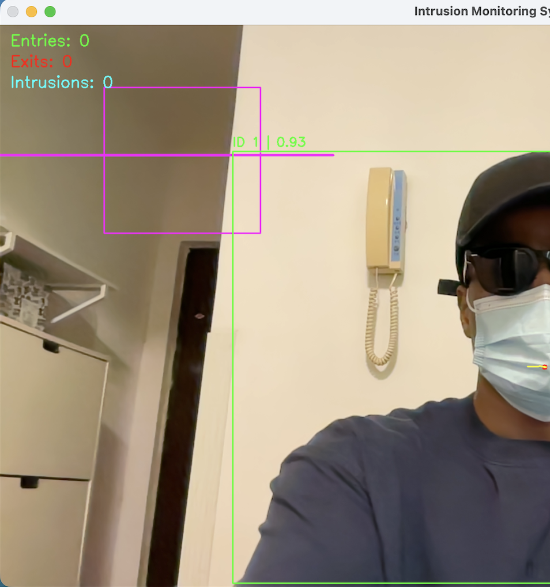
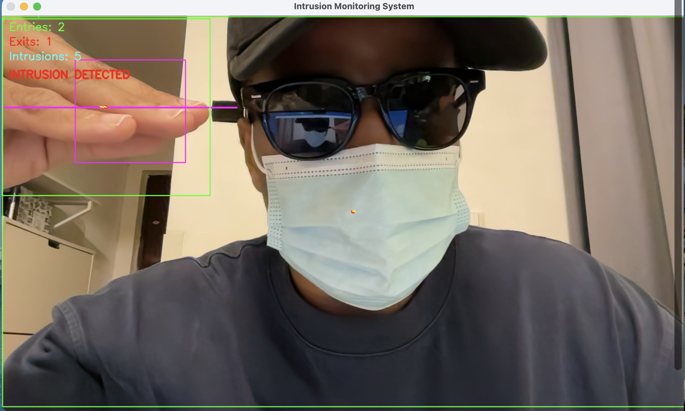

# Smart Surveillance Monitoring System

## Overview

This project is a real-time computer vision surveillance monitoring system built using YOLOv8 and OpenCV.

The system can:

* Detect people in real time
* Track people using unique IDs
* Display confidence scores
* Monitor protected zones
* Detect intrusions
* Count entries and exits
* Display tracking trails
* Save events to a log file

## Technologies Used

* Python
* YOLOv8
* OpenCV
* NumPy

## Features

Person Detection

Detects people using YOLOv8.

Object Tracking

Assigns tracking IDs to detected people.

Confidence Display

Shows confidence scores for each detection.

Zone Monitoring

Monitors a protected area and detects intrusions.

Entry / Exit Analytics

Counts people crossing a virtual line.

Event Logging

Stores intrusion and movement events in a log file.

## How to Run

Install dependencies:

pip install -r requirements.txt

Run the project:

python main.py

## Future Improvements

* RTSP/IP camera support
* Face verification
* Dashboard visualization
* Segmentation integration
* Deployment optimization

## Results

Detection and Tracking

Zone Monitoring

Intrusion Detection

